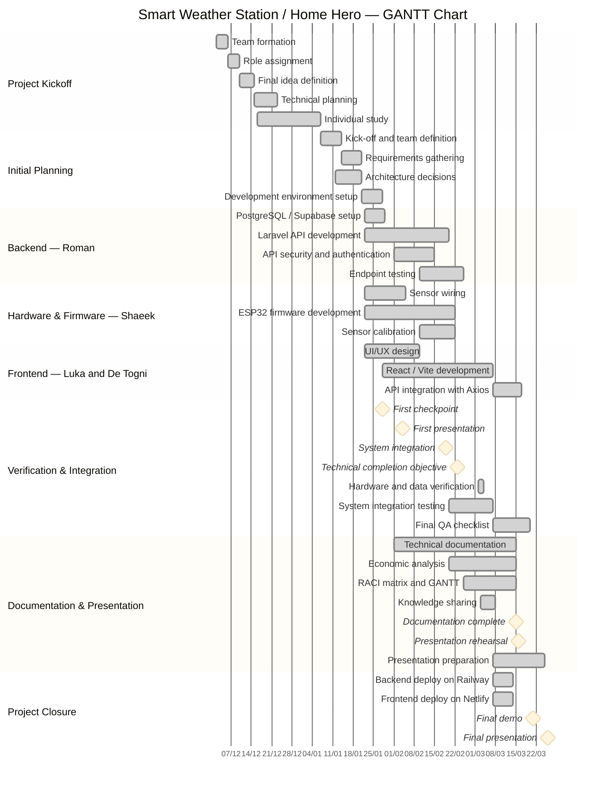

> **📖 To view this file correctly:** open **https://markdownlivepreview.com** and paste the content.
> 📊 **For the interactive GANTT:** open **https://mermaid.live** → paste the `mermaid` block below.

---

# GANTT Chart — Home Hero Project

> **Document:** Final Deliverable — Project Timeline Planning
> **Deliverable author:** De Togni Andrea
> **Information provided by:** Roman
> **Last updated:** March 2026

---

## General Information

| Field | Value |
|-------|-------|
| **Project** | Home Hero — Smart Environmental Monitoring Station with IoT Dashboard |
| **Start date** | December 2, 2025 |
| **Expected end date** | March 26, 2026 |
| **Total duration** | ~16 weeks (114 days) |
| **Team size** | 5 people |
| **Key milestones** | 8 (Checkpoints, Integration, Demo, Presentation) |

---

## GANTT — Mermaid Visualisation

> **Instructions:** Copy the block below → go to **https://mermaid.live** → paste in the editor → the GANTT renders as a downloadable chart (PNG/SVG).



---

## Status Legend

| Code status | Colour | Meaning |
|-------------|--------|---------|
| `done` | Dark green / grey | Completed activity ✅ |
| `active` | Blue / bright green | Activity in progress 🔄 |
| *(none)* | White / neutral | Planned, not yet started |
| `milestone` | Diamond ♦ | Point-in-time event — measurable key result |

---

## Activity Detail by Section

### Project Kickoff (Dec 2, 2025 – Jan 7, 2026)

| Activity | Responsible | Start | End | Status |
|----------|:-----------:|:-----:|:---:|:------:|
| Team formation | Full team | Dec 2 | Dec 6 | ✅ |
| Role assignment | Full team | Dec 6 | Dec 10 | ✅ |
| Final idea definition | Full team | Dec 10 | Dec 15 | ✅ |
| Technical planning | Roman | Dec 15 | Dec 23 | ✅ |
| Individual study | All members | Dec 16 | Jan 7 | ✅ |

### Initial Planning (Jan 8 – Jan 28, 2026)

| Activity | Responsible | Start | End | Status |
|----------|:-----------:|:-----:|:---:|:------:|
| Kick-off and team definition | Full team | Jan 8 | Jan 14 | ✅ |
| Requirements gathering | Roman + Luka | Jan 8 | Jan 15 | ✅ |
| Architecture decisions | Roman | Jan 12 | Jan 21 | ✅ |
| Development environment setup | Roman + Luka + Shaeek | Jan 21 | Jan 28 | ✅ |

### Backend (Jan 22 – Feb 25, 2026)

| Activity | Responsible | Start | End | Status |
|----------|:-----------:|:-----:|:---:|:------:|
| PostgreSQL / Supabase setup | Roman | Jan 22 | Jan 29 | ✅ |
| Laravel API development | Roman | Jan 22 | Feb 20 | ✅ |
| API security & authentication | Roman | Feb 1 | Feb 15 | ✅ |
| Endpoint testing | Roman | Feb 10 | Feb 25 | ✅ |

### Hardware & Firmware (Jan 22 – Feb 22, 2026)

| Activity | Responsible | Start | End | Status |
|----------|:-----------:|:-----:|:---:|:------:|
| Sensor wiring | Shaeek | Jan 22 | Feb 5 | ✅ |
| ESP32 firmware development | Shaeek | Jan 22 | Feb 22 | ✅ |
| Sensor calibration | Shaeek | Feb 10 | Feb 22 | ✅ |

### Frontend (Jan 22 – Mar 17, 2026)

| Activity | Responsible | Start | End | Status |
|----------|:-----------:|:-----:|:---:|:------:|
| UI/UX design | De Togni | Jan 22 | Feb 10 | ✅ |
| React / Vite development | Luka + De Togni | Jan 28 | Mar 7 | ✅ |
| API integration with Axios | Luka | Mar 7 | Mar 17 | ✅ |

### Verification & Integration

| # | Event / Activity | Date | Responsible | Status |
|:-:|-----------------|:----:|:-----------:|:------:|
| c1 | First checkpoint | Jan 28, 2026 | Full team | ✅ |
| c2 | First presentation | Feb 4, 2026 | Full team | ✅ |
| c3 | System integration | Feb 19, 2026 | Roman + team | ✅ |
| c4 | Technical completion objective | Feb 23, 2026 | Roman | ✅ |
| — | Hardware and data verification | Mar 2–4, 2026 | Shaeek + Roman | ✅ |
| — | System integration testing | Feb 20 – Mar 7 | Roman + Luka + Shaeek | ✅ |
| — | Final QA checklist | Mar 7 – Mar 20 | Matteo | ✅ |

### Documentation & Presentation (Feb 1 – Mar 25, 2026)

| Activity | Responsible | Start | End | Status |
|----------|:-----------:|:-----:|:---:|:------:|
| Technical documentation | Matteo + De Togni | Feb 1 | Mar 15 | ✅ |
| Economic analysis | De Togni | Feb 20 | Mar 15 | ✅ |
| RACI matrix and GANTT | De Togni | Feb 25 | Mar 15 | ✅ |
| Knowledge sharing | Full team | Mar 3 | Mar 8 | ✅ |
| Presentation preparation | Matteo + De Togni | Mar 7 | Mar 25 | ✅ |

### Project Closure (Mar 7 – Mar 26, 2026)

| Activity | Responsible | Start | End | Status |
|----------|:-----------:|:-----:|:---:|:------:|
| Backend deploy on Railway | Roman | Mar 7 | Mar 14 | ✅ |
| Frontend deploy on Netlify | Roman + Luka | Mar 7 | Mar 14 | ✅ |
| Final demo | Full team | Mar 21 | — | ✅ |
| Final presentation | Full team | Mar 26 | — | 🎯 |

---

## Milestones

| # | Milestone | Date | Completion criterion |
|:-:|-----------|:----:|----------------------|
| c1 | **First checkpoint** | Jan 28, 2026 | First intermediate progress review |
| c2 | **First presentation** | Feb 4, 2026 | Working prototype presented |
| c3 | **System integration** | Feb 19, 2026 | ESP32 → Backend → Dashboard communicating end-to-end |
| c4 | **Technical completion** | Feb 23, 2026 | All core features implemented and tested |
| d5 | **Documentation complete** | Mar 15, 2026 | All deliverable documents ready |
| d6 | **Presentation rehearsal** | Mar 16, 2026 | Dry run completed |
| m3 | **Final demo** | Mar 21, 2026 | Full system demonstration before team |
| m4 | **Final presentation** | Mar 26, 2026 | Delivery and presentation to instructor |

---

## Critical Path

Activities on the critical path (any delay = delay to the entire project):

```
Team formation (Dec)  →  Architecture decisions (Jan)  →  Backend API dev  →  Integration testing  →  Deploy  →  Presentation
  (Full team)              (Roman)                         (Roman)             (Roman + team)          (Roman)    (Matteo/De Togni)
```

> Roman is the most critical technical bottleneck: backend, deploy, and Git review all depend on him.

---

*Home Hero Project — Team: Roman, Luka, De Togni, Matteo, Shaeek — March 2026*

| Activity | Responsible | Start | End | Status |
|----------|:-----------:|:-----:|:---:|:------:|
| Kick-off and team definition | Full team | Jan 8 | Jan 14 | ✅ |
| Requirements gathering | Roman + Luka | Jan 8 | Jan 14 | ✅ |
| Architecture decisions | Roman | Jan 12 | Jan 21 | ✅ |
| Development environment setup | Roman + Luka + Shaeek | Jan 15 | Jan 21 | ✅ |

### Backend (Jan 22 – Feb 25, 2026)

| Activity | Responsible | Start | End | Status |
|----------|:-----------:|:-----:|:---:|:------:|
| Laravel API development | Roman | Jan 22 | Feb 20 | ✅ |
| PostgreSQL / Supabase setup | Roman | Jan 22 | Jan 29 | ✅ |
| API security & authentication | Roman | Feb 1 | Feb 15 | ✅ |
| Endpoint testing | Roman | Feb 10 | Feb 25 | ✅ |

### Hardware & Firmware (Jan 22 – Feb 22, 2026)

| Activity | Responsible | Start | End | Status |
|----------|:-----------:|:-----:|:---:|:------:|
| Sensor wiring | Shaeek | Jan 22 | Feb 5 | ✅ |
| ESP32 firmware development | Shaeek | Jan 22 | Feb 22 | ✅ |
| Sensor calibration | Shaeek | Feb 10 | Feb 22 | ✅ |

### Frontend (Jan 22 – Mar 7, 2026)

| Activity | Responsible | Start | End | Status |
|----------|:-----------:|:-----:|:---:|:------:|
| UI/UX design | De Togni | Jan 22 | Feb 10 | ✅ |
| React / Vite development | Luka | Jan 28 | Mar 7 | ✅ |
| API integration with Axios | Luka | Feb 15 | Mar 7 | ✅ |

### Integration & Testing (Feb 20 – Mar 20, 2026)

| Activity | Responsible | Start | End | Status |
|----------|:-----------:|:-----:|:---:|:------:|
| System integration testing | Roman + Luka + Shaeek | Feb 20 | Mar 7 | ✅ |
| Final QA checklist | Matteo | Mar 7 | Mar 20 | 🔄 |

### Deploy (Mar 7 – Mar 14, 2026)

| Activity | Responsible | Start | End | Status |
|----------|:-----------:|:-----:|:---:|:------:|
| Backend deploy on Railway | Roman | Mar 7 | Mar 14 | ✅ |
| Frontend deploy on Netlify | Roman + Luka | Mar 7 | Mar 14 | ✅ |

### Documentation & PM (Feb 15 – Mar 25, 2026)

| Activity | Responsible | Start | End | Status |
|----------|:-----------:|:-----:|:---:|:------:|
| Technical documentation | Matteo | Feb 15 | Mar 15 | ✅ |
| Economic analysis | De Togni | Feb 20 | Mar 15 | 🔄 |
| RACI matrix and GANTT | De Togni | Feb 25 | Mar 15 | 🔄 |
| Presentation slides preparation | Matteo + De Togni | Mar 7 | Mar 25 | 🔄 |

---

## Milestones

| # | Milestone | Date | Completion criterion |
|:-:|-----------|:----:|----------------------|
| 🔧 | **Working prototype** | Feb 23, 2026 | ESP32 sends live data → backend saves to DB → dashboard displays charts |
| 🚀 | **Production deployment** | Mar 14, 2026 | Backend on Railway + Frontend on Netlify publicly reachable |
| 🎯 | **Final demo** | Mar 21, 2026 | Full system functional demonstration before the team |
| 🏁 | **Final presentation** | Mar 26, 2026 | Delivery and presentation to the instructor |

---

## Critical Path

Activities on the critical path (any delay = delay to the entire project):

```
Laravel API dev  →  Endpoint testing  →  Integration testing  →  Deploy  →  Presentation
   (Roman)            (Roman)              (full team)           (Roman)      (Matteo)
```

> Roman is the most critical technical bottleneck: backend, deploy, and Git review all depend on him.

---

*Home Hero Project — Team: Roman, Luka, De Togni, Matteo, Shaeek — March 2026*
