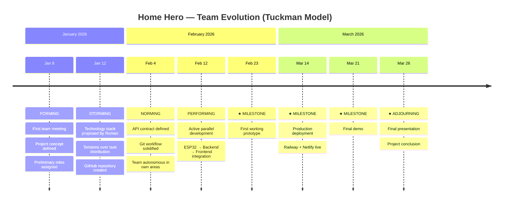

> **📖 To view this file correctly:** open **https://markdownlivepreview.com** and paste the content.
> For the Mermaid timeline: open **https://mermaid.live**

---

# Project Phases — Tuckman Model
## Home Hero — Smart Environmental Monitoring Station with IoT Dashboard

> **Document:** Final Deliverable — Team Dynamics & Project Phases
> **Deliverable author:** De Togni Andrea
> **Last updated:** March 2026

---

## The Tuckman Model

**Bruce Tuckman's model (1965)** describes the natural stages of development that any work group goes through before reaching full productivity:

```
  🔵 FORMING  →  ⚡ STORMING  →  🤝 NORMING  →  🚀 PERFORMING  →  🎯 ADJOURNING
  (formation)     (conflict)    (normalization)   (performance)    (conclusion)
```

| Phase | Italian name | Key characteristic |
|-------|--------------|-------------------|
| **Forming** | Formazione | Team gets acquainted, goals and roles defined. High enthusiasm, low clarity. |
| **Storming** | Conflitto | First tensions emerge: task division, different expectations, recurring issues. |
| **Norming** | Normalizzazione | Balance found: agreed processes, technology, workflow. Mutual trust increases. |
| **Performing** | Prestazione | Maximum productivity: everyone knows their role and executes autonomously. |
| **Adjourning** | Conclusione | Project closure, reflection on results, team dissolution. |

This framework was presented by Prof. Muggeo and applied to the Home Hero team dynamics analysis. At the time of writing, the team is in the **PERFORMING** phase.

---

## Home Hero Team Evolution

### 🔵 PHASE 1 — FORMING
**Period:** January 8, 2026 → January 14, 2026

**What happened in our team:**
- First meeting of the 5 team members
- Definition of the project concept: **smart environmental monitoring station with IoT dashboard**
- Initial discussion on the project name → **"Home Hero"** selected
- Preliminary macro-role assignment based on declared competencies
- Roman proposes the overall technical vision: ESP32 + cloud backend + React frontend
- High dependency on Roman's initiative to unlock early decisions

**Typical characteristics experienced:**
- High motivation, low operational output
- Uncertainty about which tools to adopt
- Team bonding and expectations calibration

**Closing milestone ✓:** *Team formed, concept approved, preliminary roles assigned*

---

### ⚡ PHASE 2 — STORMING
**Period:** January 12, 2026 → February 4, 2026
*(Partially overlapping with Forming — normal in school-based teams)*

**What happened in our team:**
- First tensions regarding **fair distribution of tasks** across team members
- Core challenge: balancing workload without demotivating less active members
- Recurring instability: problems were resolved only for new ones to appear
- Roman proposes the **definitive technology stack** (Laravel 11 + React/Vite + PostgreSQL on Supabase) → accepted without major opposition
- GitHub repository created; Git workflow defined (Roman manages main branch)
- Team begins to stabilise around confirmed roles

**Typical characteristics experienced:**
- Latent conflicts over task distribution
- Roman as architecture lead making unilateral decisions to unblock team stalls
- First structured communication between work areas (backend ↔ frontend ↔ hardware)

**Closing milestone ✓:** *Technology stack approved, first commit on repo, Git workflow defined*

---

### 🤝 PHASE 3 — NORMING
**Period:** February 4, 2026 → February 11, 2026

**What happened in our team:**
- Final agreement on all tools: Laravel 11, React + Vite, Supabase, Railway, Netlify
- **API contract** defined between frontend and backend (JSON structure, RESTful endpoints)
- Git workflow solidified: feature branch → Pull Request → Roman review → merge to main
- Each member works autonomously within their own domain
- First functional integrations between ESP32 and backend
- De Togni and Matteo define their structured PM/Design contributions

**Typical characteristics experienced:**
- More fluid and direct communication
- Mutual respect for roles and competencies
- Significant reduction in friction

**Closing milestone ✓:** *First working API endpoint, development environment configured on all machines*

---

### 🚀 PHASE 4 — PERFORMING ← CURRENT PHASE
**Period:** February 12, 2026 → March 26, 2026

**What happened in our team:**
- Active parallel development: backend (Roman), frontend (Luka), firmware (Shaeek), docs/design (Matteo + De Togni)
- Full system integration: ESP32 → Laravel API → PostgreSQL → React Dashboard
- Milestones reached:
  - 🔧 **Feb 23, 2026** — First working prototype (ESP32 sends live data to dashboard)
  - 🚀 **Mar 14, 2026** — Production deployment (Railway + Netlify live)
  - 🎯 **Mar 21, 2026** — Internal final demo
- Preparation of all project management documents and presentation
- Optimisations: bidirectional fan control, CSV export, dark/light themes, API security

**Typical characteristics experienced:**
- Maximum team productivity
- Technical issues resolved independently without blocking workflow
- Shared focus on the March 26, 2026 deadline

**Closing milestone ✓:** *Final presentation to the instructor — March 26, 2026*

---

### 🎯 PHASE 5 — ADJOURNING *(planned)*
**Expected date:** after March 26, 2026

- Final project delivery and assessment
- Reflection on skills acquired
- Possible continuation of the project as individual portfolio work

---

## Chronological Summary

| Phase | Period | Duration | Key event | Milestone ✓ |
|-------|--------|:--------:|-----------|:-----------:|
| 🔵 Forming | Jan 8 – Jan 14, 2026 | 7 days | First meeting, concept defined | Team formed |
| ⚡ Storming | Jan 12 – Feb 4, 2026 | ~24 days | Stack chosen, tensions managed | Repo created |
| 🤝 Norming | Feb 4 – Feb 11, 2026 | ~8 days | Shared processes, API contract | Environment configured |
| 🚀 Performing | Feb 12 – Mar 26, 2026 | ~43 days | Development, deploy, presentation | Presentation Mar 26 |
| 🎯 Adjourning | after Mar 26, 2026 | — | Project closure | Final assessment |

---

## Visual Timeline (Mermaid)

> **To visualise:** go to **https://mermaid.live** → paste the code below → the timeline renders instantly



---

*Home Hero Project — Team: Roman, Luka, De Togni, Matteo, Shaeek — March 2026*
