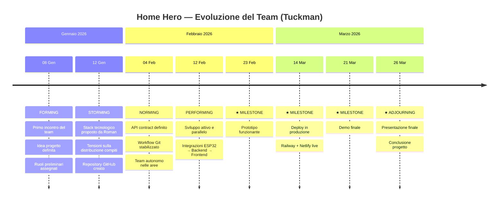

> **📖 Per visualizzare correttamente:** apri **https://markdownlivepreview.com** e incolla questo testo.
> Per la timeline Mermaid usa **https://mermaid.live**

---

# Fasi del Progetto — Modello Tuckman
## Home Hero — Stazione Meteo Intelligente con Dashboard IoT

> **Documento:** Deliverable finale — Team Dynamics & Project Phases
> **Autore deliverable:** De Togni Andrea
> **Ultima revisione:** Marzo 2026

---

## Il Modello di Tuckman

Il modello di **Bruce Tuckman (1965)** descrive le fasi evolutive naturali di qualsiasi gruppo di lavoro. Ogni team, per raggiungere la piena produttività, attraversa le seguenti fasi in sequenza:

```
  🔵 FORMING  →  ⚡ STORMING  →  🤝 NORMING  →  🚀 PERFORMING  →  🎯 ADJOURNING
   (formazione)    (conflitto)    (normalizzazione)  (prestazione)    (conclusione)
```

Questo framework è stato presentato dal Prof. Muggeo e applicato all'analisi del nostro team durante lo sviluppo del progetto Home Hero. Al momento della stesura di questo documento, il team si trova nella fase **PERFORMING** — la fase di massima produttività.

---

## Evoluzione del Team Home Hero

### 🔵 FASE 1 — FORMING (Formazione)
**Periodo:** 08 gennaio 2026 → 14 gennaio 2026

**Descrizione generale:**
Nella fase di Forming il team si incontra per la prima volta, definisce l'obiettivo comune e assegna i ruoli preliminari. Il livello di motivazione è alto ma l'operatività è ancora bassa, perché i membri si stanno ancora conoscendo e calibrando rispetto alle reciproche competenze.

**Nel progetto Home Hero:**
- Primo incontro del gruppo dei 5 componenti
- Definizione dell'idea progettuale: **stazione meteo intelligente con dashboard IoT**
- Prima discussione sul nome del progetto → scelto **"Home Hero"**
- Assegnazione preliminare dei macro-ruoli basata sulle competenze dichiarate
- Roman propone la visione tecnica complessiva: ESP32 + backend cloud + frontend React
- Alta dipendenza dall'iniziativa di Roman per sbloccare le prime decisioni

**Outcome della fase:**
✅ Team formato | ✅ Idea definita e condivisa | ✅ Ruoli preliminari assegnati

**Milestone di chiusura:** *Team formation meeting completato, concept del prodotto approvato*

---

### ⚡ FASE 2 — STORMING (Conflitto)
**Periodo:** 12 gennaio 2026 → 04 febbraio 2026
*(Parzialmente sovrapposta a Forming — fenomeno normale in team scolastici)*

**Descrizione generale:**
Nella fase di Storming emergono le prime tensioni e difficoltà. I membri si confrontano su come dividere il lavoro, nascono incomprensioni sulle aspettative, e la dinamica del gruppo viene messa alla prova. Questa è la fase più difficile ma anche essenziale per la maturazione del team.

**Nel progetto Home Hero:**
- Prime tensioni sulla **distribuzione equa dei compiti** tra i componenti
- Sfida principale: bilanciare il carico di lavoro senza demotivare i membri meno attivi
- Necessità di gestire situazioni dove un membro era sovraccarico rispetto ad un altro
- Roman propone lo **stack tecnologico definitivo** (Laravel 11 + React/Vite + PostgreSQL su Supabase) → accettato senza grandi opposizioni grazie alla chiarezza tecnica della proposta
- Creazione del **repository GitHub** e definizione del workflow (Roman gestisce il main branch)
- Il team inizia a stabilizzarsi attorno ai ruoli definiti

**Caratteristiche vissute:**
- Instabilità ricorrente: ogni problema risolto poteva essere seguito da uno nuovo
- Roman come architecture lead prende decisioni necessarie per sbloccare stalli tecnici
- Prima comunicazione strutturata tra le aree di lavoro (backend ↔ frontend ↔ hardware)

**Outcome della fase:**
✅ Stack tecnologico definitivo scelto | ✅ Repository Git creato | ✅ Ruoli confermati e stabili

**Milestone di chiusura:** *Stack tecnologico approvato, primo commit sul repo, workflow Git definito*

---

### 🤝 FASE 3 — NORMING (Normalizzazione)
**Periodo:** 04 febbraio 2026 → 11 febbraio 2026

**Descrizione generale:**
In questa fase il team raggiunte un equilibrio operativo. I conflitti si attenuano, ciascun membro conosce il proprio territorio di responsabilità e lavora in autonomia. Si stabiliscono processi condivisi e aumenta la fiducia reciproca.

**Nel progetto Home Hero:**
- Accordo definitivo su tutti gli strumenti: Laravel 11, React + Vite, Supabase, Railway, Netlify
- Definizione del **contratto API** tra frontend e backend (struttura dei JSON, endpoint RESTful)
- Workflow Git stabilizzato: feature branch → PR → review di Roman → merge su main
- Ognuno lavora in autonomia nella propria area senza richiedere validazione continua
- Prime integrazioni funzionanti tra ESP32 e backend
- De Togni e Matteo definiscono il proprio contributo PM/Design in modo strutturato

**Caratteristiche vissute:**
- Comunicazione più fluida e diretta tra i componenti
- Rispetto reciproco delle competenze e dei ruoli
- Riduzione significativa delle frizioni

**Outcome della fase:**
✅ Processi di sviluppo condivisi | ✅ API contract definito | ✅ Team autonomo nelle proprie aree

**Milestone di chiusura:** *Primo endpoint API funzionante, ambiente di sviluppo configurato su tutte le macchine*

---

### 🚀 FASE 4 — PERFORMING (Prestazione) ← FASE ATTUALE
**Periodo:** 12 febbraio 2026 → 26 marzo 2026

**Descrizione generale:**
La fase di Performing è quella di massima produttività. Il team funziona come un'unità coesa: i problemi vengono risolti rapidamente in autonomia, le attività si sovrappongono e si integrano senza frizioni. È la fase in cui si produce il valore reale del progetto.

**Nel progetto Home Hero:**
- Sviluppo parallelo attivo: backend (Roman), frontend (Luka), firmware (Shaeek), docs/design (Matteo + De Togni)
- Integrazione completa del sistema: ESP32 → API Laravel → PostgreSQL → Dashboard React
- Milestone raggiunti:
  - 🔧 **23/02/2026** — Primo prototipo funzionante (ESP32 invia dati alla dashboard)
  - 🚀 **14/03/2026** — Deploy in produzione (Railway + Netlify live)
  - 🎯 **21/03/2026** — Demo finale interna
- Preparazione della presentazione e di tutti i documenti di project management
- Ottimizzazioni: fan control bidirezionale, export CSV, temi dark/light, sicurezza API

**Caratteristiche vissute:**
- Massima produttività di tutto il team
- Problemi tecnici risolti in autonomia senza bloccare il workflow
- Focus comune sulla deadline del 26/03/2026
- Roman coordina i deploy e la visione tecnica complessiva

**Outcome della fase:**
🔄 In corso → ✅ al 26/03/2026

**Milestone di chiusura:** *Presentazione finale al professore — 26 marzo 2026*

---

### 🎯 FASE 5 — ADJOURNING (Conclusione) *(prevista)*
**Data prevista:** dopo il 26 marzo 2026

**Descrizione generale:**
La fase finale di qualsiasi progetto a tempo determinato. Il team conclude la collaborazione, riflette su quanto fatto, e si separa.

**Nel progetto Home Hero:**
- Consegna del progetto definitivo e valutazione
- Riflessione sulle competenze acquisite
- Possibile continuazione individuale del progetto come portafoglio personale

---

## Riepilogo Cronologico

| Fase | Periodo | Durata | Evento chiave | Milestone ✓ |
|------|---------|:------:|---------------|:-----------:|
| 🔵 Forming | 08/01 – 14/01/2026 | 7 giorni | Primo incontro, idea definita | Team formato |
| ⚡ Storming | 12/01 – 04/02/2026 | ~24 giorni | Stack scelto, tensioni gestite | Repo Git creato |
| 🤝 Norming | 04/02 – 11/02/2026 | ~8 giorni | Processi condivisi, API contract | Ambiente configurato |
| 🚀 Performing | 12/02 – 26/03/2026 | ~43 giorni | Sviluppo, deploy, presentazione | Presentazione 26/03 |
| 🎯 Adjourning | dopo 26/03/2026 | — | Chiusura progetto | Valutazione finale |

---

## Visualizzazione Timeline (Mermaid)

> **Per visualizzare:** vai su **https://mermaid.live** → clicca "Code" → incolla → vedrai la timeline



---

*Progetto Home Hero — Team: Roman, Luka, De Togni, Matteo, Shaeek — Marzo 2026*
