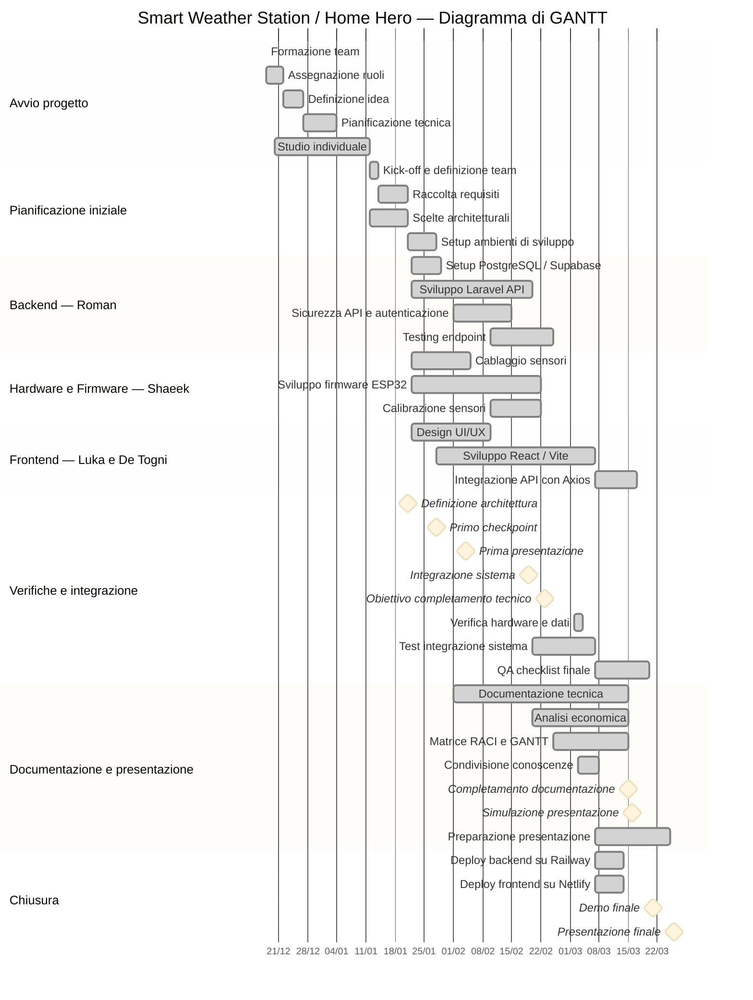

> **📖 Per visualizzare correttamente:** apri **https://markdownlivepreview.com** e incolla questo testo.
> 📊 **Per il GANTT interattivo:** apri **https://mermaid.live** → incolla il blocco `mermaid` qui sotto.

---

# Diagramma di GANTT — Progetto Home Hero

> **Documento:** Deliverable finale — Pianificazione Temporale del Progetto
> **Autore deliverable:** De Togni Andrea
> **Informazioni fornite da:** Roman
> **Ultima revisione:** Marzo 2026

---

## Informazioni Generali

| Campo | Valore |
|-------|--------|
| **Progetto** | Home Hero — Stazione Meteo Intelligente con Dashboard IoT |
| **Data inizio** | 02 dicembre 2025 |
| **Data fine prevista** | 26 marzo 2026 |
| **Durata totale** | ~16 settimane (114 giorni) |
| **Team** | 5 persone |
| **Milestone principali** | 8 (Checkpoint, Integrazione, Demo, Presentazione) |

---

## GANTT — Visualizzazione Mermaid

> **Istruzioni:** Copia il blocco qui sotto → vai su **https://mermaid.live** → incolla nell'editor → il GANTT si renderizza automaticamente come immagine scaricabile (PNG/SVG).



---

## Legenda Stati

| Stato nel codice | Colore | Significato |
|-----------------|--------|-------------|
| `done` | Verde scuro / grigio | Attività completata ✅ |
| `active` | Blu / verde chiaro | Attività in corso 🔄 |
| *(nessuno)* | Bianco / neutro | Pianificato, non ancora iniziato |
| `milestone` | Diamante ♦ | Evento puntuale — risultato chiave misurabile |

---

## Dettaglio Attività per Sezione

### Avvio progetto (02/12/2025 – 07/01/2026)

| Attività | Responsabile | Inizio | Fine | Stato |
|----------|:------------:|:------:|:----:|:-----:|
| Formazione team | Tutto il team | 02/12 | 06/12 | ✅ |
| Assegnazione ruoli | Tutto il team | 06/12 | 10/12 | ✅ |
| Definizione idea finale | Tutto il team | 10/12 | 15/12 | ✅ |
| Pianificazione tecnica | Roman | 15/12 | 23/12 | ✅ |
| Studio individuale | Tutti i membri | 16/12 | 07/01 | ✅ |

### Pianificazione iniziale (08/01 – 28/01/2026)

| Attività | Responsabile | Inizio | Fine | Stato |
|----------|:------------:|:------:|:----:|:-----:|
| Kick-off e definizione team | Tutto il team | 08/01 | 14/01 | ✅ |
| Raccolta requisiti | Roman + Luka | 08/01 | 15/01 | ✅ |
| Scelte architetturali | Roman | 12/01 | 21/01 | ✅ |
| Setup ambienti di sviluppo | Roman + Luka + Shaeek | 21/01 | 28/01 | ✅ |

### Backend (22/01 – 25/02/2026)

| Attività | Responsabile | Inizio | Fine | Stato |
|----------|:------------:|:------:|:----:|:-----:|
| Setup PostgreSQL / Supabase | Roman | 22/01 | 29/01 | ✅ |
| Sviluppo Laravel API | Roman | 22/01 | 20/02 | ✅ |
| Sicurezza API & autenticazione | Roman | 01/02 | 15/02 | ✅ |
| Testing endpoint | Roman | 10/02 | 25/02 | ✅ |

### Hardware & Firmware (22/01 – 22/02/2026)

| Attività | Responsabile | Inizio | Fine | Stato |
|----------|:------------:|:------:|:----:|:-----:|
| Cablaggio sensori | Shaeek | 22/01 | 05/02 | ✅ |
| Sviluppo firmware ESP32 | Shaeek | 22/01 | 22/02 | ✅ |
| Calibrazione sensori | Shaeek | 10/02 | 22/02 | ✅ |

### Frontend (22/01 – 17/03/2026)

| Attività | Responsabile | Inizio | Fine | Stato |
|----------|:------------:|:------:|:----:|:-----:|
| Design UI/UX | De Togni | 22/01 | 10/02 | ✅ |
| Sviluppo React / Vite | Luka + De Togni | 28/01 | 07/03 | ✅ |
| Integrazione API con Axios | Luka | 07/03 | 17/03 | ✅ |

### Verifiche e integrazione

| # | Evento / Attività | Data | Responsabile | Stato |
|:-:|------------------|:----:|:------------:|:-----:|
| c1 | Primo checkpoint | 28/01/2026 | Tutto il team | ✅ |
| c2 | Prima presentazione | 04/02/2026 | Tutto il team | ✅ |
| c3 | Integrazione sistema | 19/02/2026 | Roman + team | ✅ |
| c4 | Obiettivo completamento tecnico | 23/02/2026 | Roman | ✅ |
| — | Verifica hardware e dati | 02/03 – 04/03 | Shaeek + Roman | ✅ |
| — | Test integrazione sistema | 20/02 – 07/03 | Roman + Luka + Shaeek | ✅ |
| — | QA checklist finale | 07/03 – 20/03 | Matteo | ✅ |

### Documentazione e presentazione (01/02 – 25/03/2026)

| Attività | Responsabile | Inizio | Fine | Stato |
|----------|:------------:|:------:|:----:|:-----:|
| Documentazione tecnica | Matteo + De Togni | 01/02 | 15/03 | ✅ |
| Analisi economica | De Togni | 20/02 | 15/03 | ✅ |
| Matrice RACI e GANTT | De Togni | 25/02 | 15/03 | ✅ |
| Condivisione conoscenze | Tutto il team | 03/03 | 08/03 | ✅ |
| Preparazione presentazione | Matteo + De Togni | 07/03 | 25/03 | ✅ |

### Chiusura (07/03 – 26/03/2026)

| Attività | Responsabile | Inizio | Fine | Stato |
|----------|:------------:|:------:|:----:|:-----:|
| Deploy backend su Railway | Roman | 07/03 | 14/03 | ✅ |
| Deploy frontend su Netlify | Roman + Luka | 07/03 | 14/03 | ✅ |
| Demo finale | Tutto il team | 21/03 | — | ✅ |
| Presentazione finale | Tutto il team | 26/03 | — | 🎯 |

---

## Milestone / Traguardi

| # | Milestone | Data | Criterio di completamento |
|:-:|-----------|:----:|--------------------------|
| c1 | **Primo checkpoint** | 28/01/2026 | Prima verifica intermedia del progresso |
| c2 | **Prima presentazione** | 04/02/2026 | Prototipo funzionante presentato |
| c3 | **Integrazione sistema** | 19/02/2026 | ESP32 → Backend → Dashboard comunicanti end-to-end |
| c4 | **Completamento tecnico** | 23/02/2026 | Tutte le funzionalità principali implementate e testate |
| d5 | **Documentazione completa** | 15/03/2026 | Tutti i documenti di consegna pronti |
| d6 | **Simulazione presentazione** | 16/03/2026 | Prova generale completata |
| m3 | **Demo finale** | 21/03/2026 | Dimostrazione sistema completo davanti al team |
| m4 | **Presentazione finale** | 26/03/2026 | Consegna e presentazione al professore |

---

## Percorso Critico

Le attività sul percorso critico (ritardo = ritardo dell'intero progetto):

```
Formazione team (Dic)  →  Scelte architetturali (Gen)  →  Sviluppo Laravel API  →  Test integrazione  →  Deploy  →  Presentazione
  (Tutto il team)            (Roman)                        (Roman)                (Roman + team)        (Roman)    (Matteo/De Togni)
```

> Roman è il collo di bottiglia tecnico più critico: backend, deploy, e review Git dipendono tutti da lui.

---

*Progetto Home Hero — Team: Roman, Luka, De Togni, Matteo, Shaeek — Marzo 2026*

| Attività | Responsabile | Inizio | Fine | Stato |
|----------|:------------:|:------:|:----:|:-----:|
| Kick-off e definizione team | Tutto il team | 08/01 | 14/01 | ✅ |
| Raccolta requisiti | Roman + Luka | 08/01 | 14/01 | ✅ |
| Scelte architetturali | Roman | 12/01 | 21/01 | ✅ |
| Setup ambienti di sviluppo | Roman + Luka + Shaeek | 15/01 | 21/01 | ✅ |

### Backend (22/01 – 25/02/2026)

| Attività | Responsabile | Inizio | Fine | Stato |
|----------|:------------:|:------:|:----:|:-----:|
| Sviluppo Laravel API | Roman | 22/01 | 20/02 | ✅ |
| Setup PostgreSQL / Supabase | Roman | 22/01 | 29/01 | ✅ |
| Sicurezza API & autenticazione | Roman | 01/02 | 15/02 | ✅ |
| Testing endpoint | Roman | 10/02 | 25/02 | ✅ |

### Hardware & Firmware (22/01 – 22/02/2026)

| Attività | Responsabile | Inizio | Fine | Stato |
|----------|:------------:|:------:|:----:|:-----:|
| Cablaggio sensori | Shaeek | 22/01 | 05/02 | ✅ |
| Sviluppo firmware ESP32 | Shaeek | 22/01 | 22/02 | ✅ |
| Calibrazione sensori | Shaeek | 10/02 | 22/02 | ✅ |

### Frontend (22/01 – 07/03/2026)

| Attività | Responsabile | Inizio | Fine | Stato |
|----------|:------------:|:------:|:----:|:-----:|
| Design UI/UX | De Togni | 22/01 | 10/02 | ✅ |
| Sviluppo React / Vite | Luka | 28/01 | 07/03 | ✅ |
| Integrazione API con Axios | Luka | 15/02 | 07/03 | ✅ |

### Integrazione & Testing (20/02 – 20/03/2026)

| Attività | Responsabile | Inizio | Fine | Stato |
|----------|:------------:|:------:|:----:|:-----:|
| Test integrazione sistema | Roman + Luka + Shaeek | 20/02 | 07/03 | ✅ |
| QA checklist finale | Matteo | 07/03 | 20/03 | 🔄 |

### Deploy (07/03 – 14/03/2026)

| Attività | Responsabile | Inizio | Fine | Stato |
|----------|:------------:|:------:|:----:|:-----:|
| Deploy backend su Railway | Roman | 07/03 | 14/03 | ✅ |
| Deploy frontend su Netlify | Roman + Luka | 07/03 | 14/03 | ✅ |

### Documentazione & PM (15/02 – 25/03/2026)

| Attività | Responsabile | Inizio | Fine | Stato |
|----------|:------------:|:------:|:----:|:-----:|
| Documentazione tecnica | Matteo | 15/02 | 15/03 | ✅ |
| Analisi economica | De Togni | 20/02 | 15/03 | 🔄 |
| Matrice RACI e GANTT | De Togni | 25/02 | 15/03 | 🔄 |
| Preparazione presentazione | Matteo + De Togni | 07/03 | 25/03 | 🔄 |

---

## Milestone

| # | Milestone | Data | Criterio di completamento |
|:-:|-----------|:----:|--------------------------|
| 🔧 | **Prototipo funzionante** | 23/02/2026 | ESP32 invia dati reali → backend salva su DB → dashboard mostra grafici |
| 🚀 | **Deploy in produzione** | 14/03/2026 | Backend su Railway + Frontend su Netlify pubblicamente raggiungibili |
| 🎯 | **Demo finale** | 21/03/2026 | Dimostrazione funzionamento sistema completo davanti al team |
| 🏁 | **Presentazione finale** | 26/03/2026 | Consegna e presentazione al professore |

---

## Percorso Critico

Le attività sul percorso critico (ritardo = ritardo dell'intero progetto):

```
Sviluppo Laravel API  →  Testing endpoint  →  Test integrazione  →  Deploy  →  Presentazione
     (Roman)               (Roman)            (tutto il team)      (Roman)      (Matteo)
```

> Roman è il collo di bottiglia tecnico più critico: backend, deploy, e review Git dipendono tutti da lui.

---

*Progetto Home Hero — Team: Roman, Luka, De Togni, Matteo, Shaeek — Marzo 2026*
